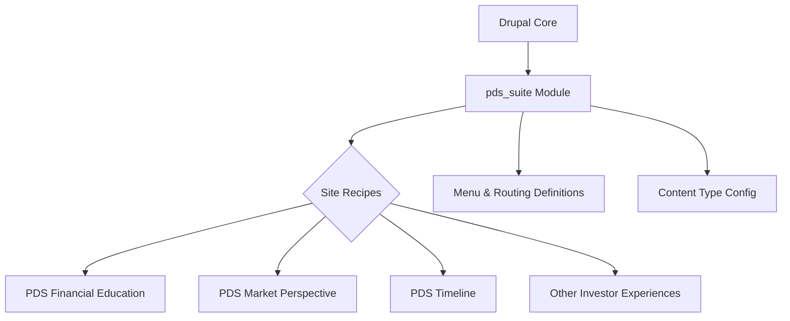

# Lingua Drupal Toolkit

Lingua provides a custom Drupal suite that packages the `pds_suite` module together with a collection of site recipes tailored for investor-focused content experiences. The repository is organized to make it easy to enable the module and selectively apply preconfigured content models across different site builds.

## Architecture Overview

- **Custom Module (`modules/custom/pds_suite`)** – Supplies Drupal with additional configuration, menu links, routes, and module metadata through standard `.info.yml`, `.routing.yml`, and `.links.menu.yml` files. The module delivers the base functionality that the recipes build upon.
- **Recipe Collection (`recipes/*/recipe.yml`)** – Each recipe bundles configuration for a specific investor experience (for example, Market Perspective or Timeline). Recipes declare their dependency on the `pds_suite` module and import the relevant content types, views, and supporting configuration stored with the module.
- **Drupal Core Integration** – The module and recipes rely on Drupal's configuration management system. When recipes are applied, the referenced configuration is synced into Drupal, enabling the associated content architecture within the site.

## Architecture Diagram

## Installation Steps

1. **Add the module to your Drupal codebase.** Place the contents of `modules/custom/pds_suite` into the `web/modules/custom/` directory of your Drupal project (create the directory if it does not exist).
2. **Enable the module.** From the project root, run `drush en pds_suite` to enable the custom functionality and exportable configuration provided by the module.
3. **Import configuration via recipes.** Apply the desired recipes using Drupal Recipes (Drupal 10.3+):
   - Copy the relevant recipe directory (for example, `recipes/PDS_financial_education`) into your project's `recipes/` directory.
   - Execute `drush recipes:apply PDS_financial_education` (replace with any other recipe folder name) to import the configuration defined by that recipe.
4. **Verify configuration.** Log in to your Drupal administration UI and confirm that the new content types, menu entries, and routes are available and functioning as expected.

## Additional Notes

- Recipes are additive—apply only the ones required for a given site build to avoid unnecessary content types or configuration.
- To revert configuration changes, use Drupal's `drush config:delete` or configuration synchronization tools as appropriate for your deployment workflow.
