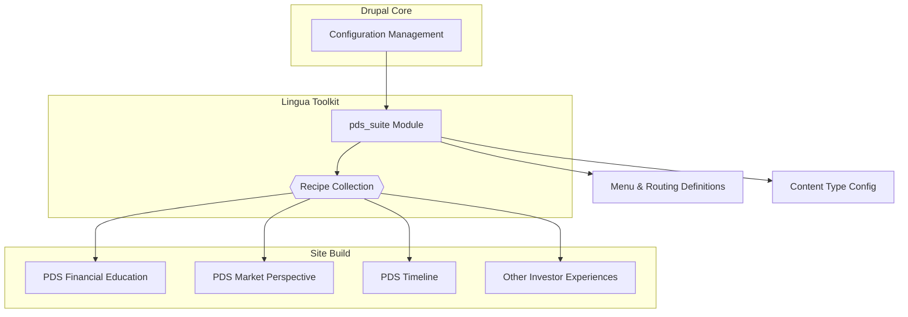

# Lingua Drupal Toolkit
> Opinionated module + recipe pack for investor-focused Drupal builds.

<p align="center">
  
  <br><sub>Enable <code>pds_suite</code>, apply recipes, ship consistent investor experiences.</sub>
</p>

<div align="center">

[](https://github.com/ORG/REPO/actions/workflows/ci.yml)
[](https://app.codecov.io/gh/ORG/REPO)


</div>

---

## Table of contents
- [Highlights](#highlights)
- [TL;DR](#tldr)
- [What's inside](#whats-inside)
- [Requirements](#requirements)
- [Install](#install)
- [Recipe catalog](#recipe-catalog)
- [Architecture](#architecture)
- [Common tasks](#common-tasks)
- [Local development tips](#local-development-tips)
- [Troubleshooting](#troubleshooting)
- [Contributing](#contributing)
- [License](#license)
- [Changelog](#changelog)

---

## Highlights
- ⚡️ **Fast onboarding** – enable the base module, run a recipe, and Drupal is seeded with curated investor content models.
- 🧱 **Composable recipes** – mix-and-match 18 focused `pds_` experiences without duplicating configuration.
- 🧭 **Governed structure** – consistent menus, view modes, and taxonomy ensure every site launch follows the same playbook.
- 🛠️ **Dev-friendly** – everything is exportable and CI-ready through Drupal Configuration Management.

---

## TL;DR
```bash
//1.- Enable the base module
drush en pds_suite -y

//2.- Apply any recipe (example)
drush recipes:apply PDS_financial_education -y
```

> 🚧 **Heads-up:** Recipes are additive. Apply only what you need.

---

## What's inside
- **Custom module** `modules/custom/pds_suite`
  - Menu links, routes, and exportable config (`.info.yml`, `.routing.yml`, `.links.menu.yml`) used by recipes.
- **Recipe collection** `recipes/*/recipe.yml`
  - Packaged content models, views, and config for specific investor experiences. Each recipe depends on `pds_suite`.
- **Drupal core integration**
  - Uses Drupal Configuration Management so recipes sync referenced config straight into your site.

---

## Requirements
- Drupal **10.3+**
- PHP **8.1+**
- Drush **11+**
- Drupal **Recipes** (ships with Drupal 10.3+)

---

## Install
1. **Place the module**
   ```
   web/modules/custom/pds_suite/
   ```
2. **Enable it**
   ```bash
   //1.- Enable the module
   drush en pds_suite -y

   //2.- Rebuild caches
   drush cr
   ```
3. **Add desired recipes**
   - Copy any recipe folder into your project’s `recipes/` directory, for example:
     ```
     recipes/PDS_financial_education
     recipes/PDS_market_perspective
     recipes/PDS_timeline
     ```
   - Apply your selection:
     ```bash
     //1.- Import curated configuration
     drush recipes:apply PDS_financial_education -y
     ```
4. **Verify**
   - In the admin UI, confirm new content types, menus, routes, and views appear.

<details>
  <summary><strong>One-liner apply (copy-ready)</strong></summary>

  ```bash
  //1.- Fail fast on errors and unset variables
  set -euo pipefail

  //2.- Enable the foundational module
  drush en pds_suite -y

  //3.- Apply the desired recipe
  drush recipes:apply PDS_market_perspective -y

  //4.- Rebuild caches
  drush cr
  ```
</details>

---

## Recipe catalog
The table lists every bundled `pds_` recipe, the curated experience it targets, and the configuration it imports from `pds_suite`.

| Recipe key | Experience focus | Imports from `pds_suite` |
|------------|------------------|---------------------------|
| `PDS_actionable_insights` | Highly curated insight collections for decision makers. | `node.type.insights`<br>`node.type.financial_education` |
| `PDS_carousel_trajectory` | Carousel storytelling with executive and insight highlights. | `node.type.executives`<br>`node.type.insights` |
| `PDS_contact_form` | Investor support pathways and contact journeys. | `system.menu.pds_header`<br>`node.type.executives` |
| `PDS_country_selection` | Country landing experiences with taxonomy-ready menus. | `system.menu.pds_global`<br>`node.type.insights` |
| `PDS_experts_cards` | Reusable executive profile cards. | `node.type.executives`<br>`node.type.insights` |
| `PDS_financial_education` | Learning-focused resources for investors. | `node.type.financial_education`<br>`node.type.ways_to_invest` |
| `PDS_investment_strategies` | Structured strategy narratives with global menus. | `node.type.investment_strategies`<br>`system.menu.pds_global` |
| `PDS_latest_insights` | Latest thought leadership across verticals. | `node.type.insights`<br>`node.type.investment_strategies` |
| `PDS_map` | Interactive geographic visualization support. | `system.menu.pds_global`<br>`node.type.ways_to_invest` |
| `PDS_market_perspective` | Thematic landing pages for market outlook narratives. | `node.type.market_perpectives`<br>`node.type.financial_education` |
| `PDS_motal_pageout` | Modal handoffs that blend regulatory notices with contact flows. | `node.type.regulatory_notices`<br>`system.menu.pds_footer` |
| `PDS_principal_executives` | Executive directories with dedicated navigation. | `node.type.executives`<br>`system.menu.pds_header` |
| `PDS_receive_updates` | Newsletter signup and retention experiences. | `node.type.insights`<br>`node.type.financial_education` |
| `PDS_regulatory_notices` | Publication-ready compliance updates. | `node.type.regulatory_notices`<br>`system.menu.pds_footer` |
| `PDS_timeline` | Chronological storytelling using insights and market perspectives. | `node.type.insights`<br>`node.type.market_perpectives` |
| `PDS_video_button` | Embedded multimedia calls-to-action. | `system.menu.pds_header`<br>`node.type.insights` |
| `PDS_ways_to_invest` | Guidance pathways for investor personas. | `node.type.ways_to_invest`<br>`system.menu.pds_global` |
| `PDS_weekly_insights` | Weekly digests for subscribers and newsletter feeds. | `node.type.insights`<br>`node.type.market_perpectives` |

---

## Architecture


---

## Common tasks
**Re-apply a recipe after tweaks**
```bash
//1.- Re-import the recipe configuration
drush recipes:apply PDS_market_perspective -y
```

**Remove config introduced by a recipe**
```bash
//1.- Delete the targeted configuration object
drush config:delete <config_name>
```

**Full config export (for CI)**
```bash
//1.- Export the active configuration snapshot
drush cex -y
```

**Cache clear**
```bash
//1.- Flush all caches for Drupal
drush cr
```

---

## Local development tips
- Keep most custom config in `pds_suite/config/install` so recipes stay minimal and reusable.
- Reuse machine names across recipes to avoid collisions.
- Prefer view modes and display modes over per-node theming.
- Document breaking config changes in a `CHANGELOG.md`.

---

## Troubleshooting
- **“Command not found: recipes:apply”** – ensure Drupal **10.3+** and Drush **11+**. Verify the Recipes feature is available in your build.
- **Config import conflicts** – export a clean baseline (`drush cex -y`) or import pending config (`drush cim -y`) before applying recipes.
- **Missing menu/route after enable** – clear caches (`drush cr`). Confirm `pds_suite` is enabled (`drush pm:list | grep pds_suite`).
- **Permissions** – ensure your deploy user can write to `web/modules/custom/` and `recipes/`.

---

## Contributing
- Put new recipes under `recipes/<RecipeName>/recipe.yml`.
- Use PascalCase for recipe folder names; use the exact key when applying.
- Include a short `README.md` in each recipe folder describing content types and dependencies.
- Add or update badges (CI, coverage) as pipelines evolve.

---

## License
MIT. See `LICENSE`.

---

## Changelog
- **v0.1.0** Initial toolkit: `pds_suite` + three recipes.
